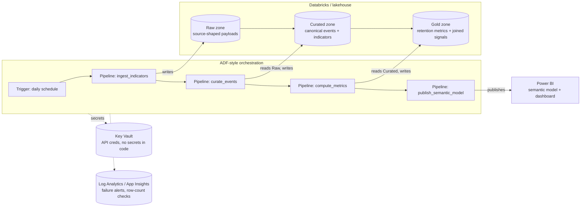

# Production architecture mapping

This repo runs the whole pipeline as local Python + a static HTML
dashboard, by design (software-emphasis track — no paid infrastructure
required to review it). This document maps that local shape onto a
production Azure-style stack, as the assessment brief asks for.

## Mapping table

| Concern | This repo (local) | Production mapping |
|---|---|---|
| Orchestration | `scripts/run_all.sh`, one manual/CI-triggered command | Azure Data Factory (or equivalent) pipeline with a daily trigger; each pipeline stage below maps 1:1 to a current module |
| Ingestion | `ingestion/eurostat_client.py`, writes CSV to `data/curated/` | ADF copy/notebook activity landing raw JSON-stat payloads into a lakehouse **raw** zone, partitioned by `indicator_id`/`retrieved_at` date |
| Curation | `curate/canonicalize.py` | Databricks notebook/job reading the raw zone, writing typed, quality-flagged Delta tables to a **curated** zone; `quality_flags` becomes a Delta column with a data-quality dashboard on top |
| Metrics + temporal join | `domain/retention_metrics.py`, `domain/temporal_join.py` | Databricks job producing a **gold** Delta table per objective and per country-quarter, keyed and versioned |
| Analysis | `analysis/association.py` | Scheduled notebook run, output written to gold as a small "insights" table consumed by the semantic model |
| Consumption | `dashboard/index.html` (static, self-contained) | Power BI semantic model over the gold tables, published to a workspace; report visuals map directly to the dashboard's four sections (Explore/Understand/Challenge/Trust) |
| Secrets | None needed (public API, no key) | Any future provider requiring an API key stored in Azure Key Vault, referenced by the ADF pipeline via a Key Vault-backed linked service — never hardcoded or committed |
| Scheduling | Manual (`run_all.sh`) | ADF trigger, cadence matched to the slowest indicator's publication cadence (quarterly for `job_vacancy_rate`) with a daily "check for new data" pattern |
| Observability | Python `logging` to stdout, explicit per-indicator success/failure logging in `cli.py` | Log Analytics / Application Insights; alert on partial-failure runs (the CLI's non-zero exit code on total failure, warning-level log on partial failure, map directly to alert severities) |
| Storage | Local `data/raw/`, `data/curated/` folders | ADLS Gen2 (or Databricks-managed storage) with raw/curated/gold containers, lifecycle policies on the raw zone |
| Access control | Filesystem permissions | Unity Catalog (or ADLS RBAC) grants scoped per zone; curated/gold readable by BI service principal, raw restricted to the ingestion job identity |
| Promotion between environments | Git branches, manual `pip install -e .` | Standard dev/test/prod ADF + Databricks workspace separation, promoted via CI/CD (e.g. Azure DevOps or GitHub Actions) running this repo's `pytest` suite as a gate before promotion |

## What stays true at any scale

- The adapter boundary (`ingestion/eurostat_client.py` is the only module
  that knows Eurostat's URL shape) means swapping in a lakehouse-native
  connector later does not require touching curation or metrics code.
- The `is_clean_for_analysis` / `quality_flags` pattern maps directly onto
  a Delta Live Tables-style expectation/quarantine pattern without a
  redesign.
- The publication-lag / `available_from` temporal-join logic is the same
  regardless of whether it runs over a pandas DataFrame locally or a
  Spark DataFrame in Databricks — the rule, not the engine, is what
  matters, and it is isolated in one module (`domain/temporal_join.py`).
